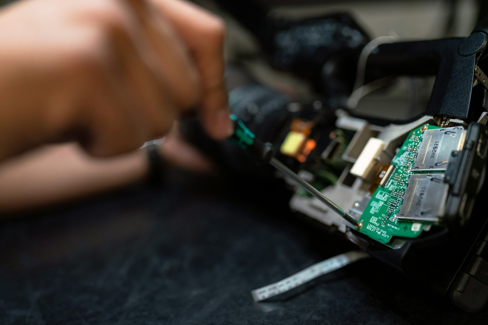

# Spriha Associate — Website Redesign

A complete frontend redesign of the official website for **Spriha Associate**, an industrial electronics repair and automation solutions company based in Vadodara, Gujarat. Built with vanilla HTML, CSS, and JavaScript — no frameworks, no build tools, no dependencies.

---

## Preview



---

## About the Project

Spriha Associate has been repairing industrial electronics for over 15 years — drives, PCBs, HMIs, VFDs, PLCs, and more. The goal of this redesign was to give the company a website that looks as professional as their work. The old design was dated and didn't reflect the quality of service they provide.

This version is built to feel modern, credible and conversion-focused — the kind of site that makes a plant manager trust you before they read a word.

---

## Features

- **Animated preloader** — SVG circuit path drawing effect with progress counter
- **Custom cursor** — red dot + trailing ring, hides the OS cursor on desktop
- **Hero slider** — 5 slides with Ken Burns image zoom, word-reveal text animation, keyboard and swipe support
- **Particle canvas** — subtle red dot network rendered over the hero background
- **Scroll reveal animations** — elements fade/slide in as they enter the viewport
- **3D card tilt** — equipment and feature cards track the mouse with perspective
- **Magnetic buttons** — primary CTAs elastically attract the cursor
- **Parallax CTA section** — background scrolls at a different speed than content
- **Horizontal services carousel** — 16 repair service cards with JS-calculated widths, prev/next controls
- **Infinite marquee** — two-row brand ticker running in opposite directions
- **Brand logos via Clearbit API** — with text fallback if a logo fails to load
- **Colorful Google Maps embed** — full-width in the footer with the business pinned
- **Scrollspy navigation** — nav link highlights based on active section
- **Auto-hiding header** — disappears on scroll down, reappears on scroll up
- **Scroll progress bar** — red gradient bar along the top of the page
- **WhatsApp float button** — fixed bottom-right with pulse ring animation
- **Contact form → WhatsApp** — form composes and opens a pre-filled WhatsApp message; no backend required
- Fully **responsive** down to 320px
- Respects **prefers-reduced-motion** — all animations disabled cleanly for accessibility

---

## Sections

| Section | Description |
|---|---|
| Hero | Full-viewport 5-slide image slider with particle canvas and animated copy |
| Trust Strip | Client logos — Panasonic, Essar, IOCL, L&T |
| About | Company story, floating experience badge, floating boards-repaired pill |
| Services | 16 repair service cards on a dark background, horizontal carousel |
| Industries | 4 image cards — Oil & Gas, Manufacturing, Power & Energy, Electronics |
| Equipment | 6 lab equipment cards with 3D tilt and image zoom |
| Process | Vertical 5-step repair timeline with icons |
| Why Us | 4 feature cards with animated bottom bar |
| Brands | Dual infinite marquee of 28+ supported brand logos |
| CTA Band | Full-bleed parallax call-to-action |
| Contact | Dark section with contact info and WhatsApp quote form |
| Footer | Full-width Google Maps, links, contact details, copyright |

---

## Tech Stack

- **HTML5** — semantic markup, ARIA labels, skip link
- **CSS3** — custom properties, grid, flexbox, keyframe animations, clip-path, backdrop-filter
- **Vanilla JavaScript** — IntersectionObserver, Canvas API, requestAnimationFrame, no libraries
- **Google Fonts** — Poppins, Inter, Space Grotesk
- **Clearbit Logo API** — for brand logos in the marquee
- **Google Maps Embed API** — colorful map in the footer
- **Unsplash** — supplementary imagery (free commercial license)

No jQuery. No npm. No build step. Just open `index.html`.

---

## File Structure

```
spriha-redesign/
├── index.html              # Single-page site — all content here
├── README.md
└── assets/
    ├── css/
    │   └── style.css       # Complete stylesheet (~855 lines)
    ├── js/
    │   └── main.js         # All interactivity (~510 lines)
    └── img/
        ├── banner/         # Hero slides, about image, CTA background
        ├── gallery/        # Equipment photos, feature icons
        └── logo/           # Client logos (Panasonic, Essar, IOCL, L&T, Spriha)
```

---

## Running Locally

No server needed — just double-click `index.html`.

Or for a clean local server (avoids any browser `file://` quirks):

```bash
# Python
python -m http.server 8000

# Node
npx serve .
```

Then open `http://localhost:8000`.

---

## Color Palette

| Name | Hex | Usage |
|---|---|---|
| Red | `#e21b22` | Primary brand color, CTAs, accents |
| Dark | `#0d0d14` | Dark sections (Services, Contact, Footer) |
| White | `#ffffff` | Light sections |
| Ink | `#12121a` | Body text |
| Ink Soft | `#4a4a5a` | Secondary text |
| Tint | `#f2f3f9` | Alternating light sections (Equipment, Why Us) |

---

## Contact Info (Live on Site)

- **Phone:** +91 97128 00416
- **Email:** spriha.service@gmail.com / info.spriha@gmail.com
- **Address:** 13, Shree Sitaram Kutir Soc., near Sai Chokdi, Manjalpur, Vadodara, Gujarat 390011

---

## Notes

- This is a purely static frontend — there is no backend or database
- The contact form does not use a backend; on submit it opens a pre-filled WhatsApp message to the business number
- External images are loaded from Unsplash CDN and Clearbit Logo API (internet connection required)
- The custom cursor is disabled automatically on touch devices
- All animations are disabled when the OS has reduced motion enabled (`prefers-reduced-motion: reduce`)
- The footer year is set dynamically by JavaScript
